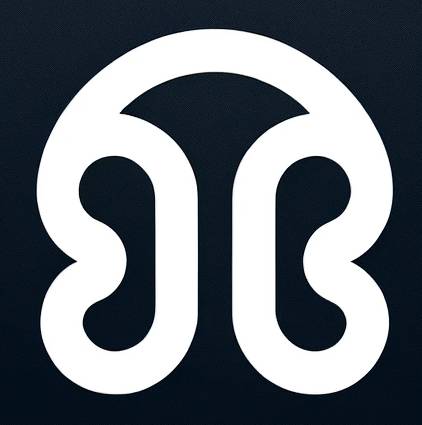
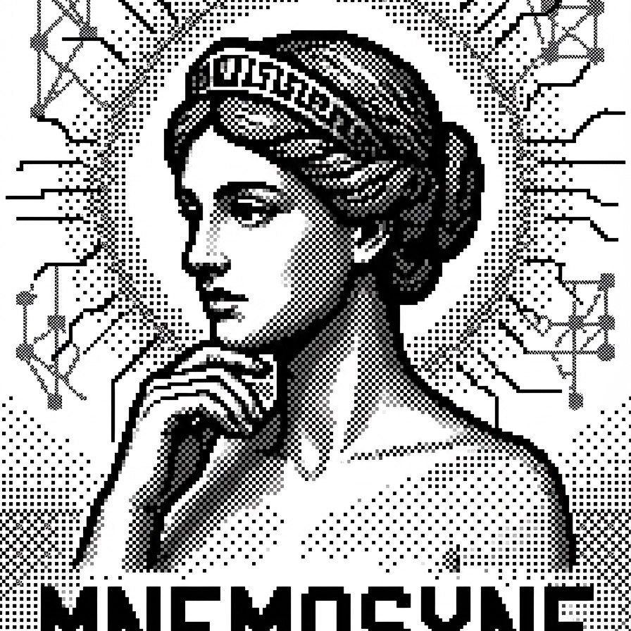
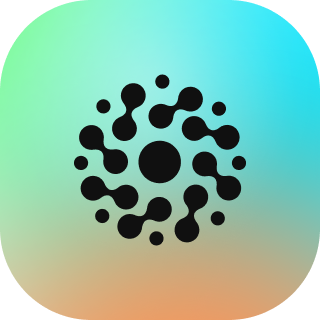

<div align="center">

```
   ●───●───●───────────●   main
        \             /
         ●───●───────╯      hypothesis-A   ✓ merged
              \
               ●            hypothesis-B   ✗ kept, never lost
```

# MemForks

### `git` for AI agent memory

A versioned commit graph; branches, forks, merges, time-travel for everything
your agents learn.

<br/>

[](https://www.npmjs.com/package/@memfork/cli)
&nbsp;[](research/SPEC.md)
&nbsp;[](https://sui.io)
&nbsp;[](tests/cli)
&nbsp;[](https://memforks.dev)
&nbsp;[](LICENSE)

</div>

---

## Contents

- [Overview](#overview)
  - [The Problem](#the-problem)
  - [What it is](#what-it-is)
  - [Who it's for](#who-its-for)
- [Getting Started](#getting-started)
  - [Quick start](#quick-start)
  - [How the agent uses it](#how-the-agent-uses-it)
  - [Configuration](#configuration)
  - [memfork init --quick](#memfork-init---quick)
  - [memfork install](#memfork-install)
- [Built with MemForks](#built-with-memforks)
- [Adapters](#adapters)
  - [Vercel AI SDK](#vercel-ai-sdk)
  - [LangGraph](#langgraph)
- [Reference apps](#reference-apps)
  - [memforks-chat](#memforks-chat)
  - [memforks-research](#memforks-research)
  - [Visualizer](#visualizer)
- [Architecture & Internals](#architecture--internals)
  - [How it uses Walrus, Sui & SEAL](#how-it-uses-walrus-sui--seal)
  - [Artifact storage](#artifact-storage)
  - [Repository structure](#repository-structure)
- [How it compares](#how-it-compares)
- [Project](#project)
  - [Status](#status)
  - [Vision](#vision)
  - [What's next](#whats-next)
  - [Development](#development)
  - [Documentation](#documentation)
  - [Links](#links)
- [License](#license)

---

## Overview

### The Problem

Remembering is the easy part now. Plenty of good tools can persist what an agent learns across sessions. What none of them give you is _version control_ over that memory, and without it, persistence quietly starts working against you.

Persistent memory layers like [MemWal](docs.memwal.ai/getting-started/what-is-memwal) solve the _storage_ half: durable, encrypted, semantically-recalled memory on Walrus. But persistence alone leaves memory as a **flat, linear append-log**, and that breaks down the moment agents do real work:

- **No isolation.** An agent can't explore a risky hypothesis without polluting the good context. Rolling back means losing everything since the last good state.
- **No parallel exploration.** Running competing strategies means cloned memory blobs nobody can merge back.
- **No collaboration semantics.** Two agents writing to shared memory is last-write-wins. No merge protocol, no conflict resolution, no provenance.
- **No auditability.** When an agent reaches a conclusion, the trail of _why_ (including the alternatives it considered and rejected) is gone with the session.

Git solved exactly these problems for code. MemForks solves them for agent memory.

### What it is

MemForks is the version-control layer on top of the Walrus memory stack; the same conceptual leap that Git made
for code, applied to what AI agents learn and remember

| Layer                                                                                           | Technology             | Responsibility                                         |
| ----------------------------------------------------------------------------------------------- | ---------------------- | ------------------------------------------------------ |
|            | MemWal + Walrus + SEAL | Encrypted blob storage and semantic recall             |
|  | MemForks (this repo)   | Immutable commit DAG, branch semantics, merge protocol |
|         | Sui                    | Cryptographic anchoring, resolver voting, finality     |

MemWal handles _where_ memories live. MemForks handles _when_ they were recorded, _which branch_ they belong to, and _how_ conflicting memories get reconciled.

Three primitives:

1. **Forkable memory trees.** `MemoryTree` is a Sui Move object; branches are named pointers into a content-addressed commit DAG. Commits are encrypted blobs on Walrus; forking is a pointer write, free and instant.
2. **Composable merge resolvers.** Merges aren't a vibe check from one model. Typed, on-chain merge policies: `JuryReconcile(k-of-n)` with signed attestations enforced by the Move contract, `LlmReconcile`, `LastWriteWins`, `Union`, and combinators (`Sequence`, `And`).
3. **Branch-scoped delegates.** Capability objects that say "this agent may write to branch X, fork from Y, but cannot merge into main." Self-enforcing through Move preconditions.

The result: agents can explore in parallel, merge with verifiable governance, and produce a cryptographically auditable trail of how every conclusion was reached, **including the paths that lost**. A log remembers what you chose. MemForks remembers what you rejected, and why.

> MemForks versions what the agent _knows_, not what it _makes_. Artifact storage (datasets, reports, files an agent produces) is a sibling concern; commits carry `ArtifactRef` entries so files written to Walrus directly inherit the same provenance trail — and the CLI exposes this as `memfork commit --file <path>`.

**Go deeper:** [MemForks vs Git](docs/git-comparison.md) maps every git concept to its MemForks equivalent, the [protocol spec](research/SPEC.md) defines the on-chain data model, wire format, and resolver semantics, and [Architecture](docs/architecture.md) walks the full stack and data flows.

### Who it's for

| Who                                                                  | What MemForks gives them                                                                                                                                    |
| -------------------------------------------------------------------- | ----------------------------------------------------------------------------------------------------------------------------------------------------------- |
| **Agent app builders** (LangGraph, Vercel AI SDK)                    | One-line adapter replaces the hand-rolled vector-DB memory layer and adds branching per user/session, A/B strategies, rollback, and per-fact Sui provenance |
| **Coding-agent teams** (Cursor + Codex on one codebase)              | One shared `MemoryTree`: a convention taught to one tool is recalled by the other, across different machines, tools, and sessions                           |
| **Operators of long-running agents** (research, trading, monitoring) | Fork strategies, auto-abandon underperformers via evaluator resolvers, roll back bad decisions without losing accumulated context                           |
| **Multi-agent systems**                                              | A real merge protocol for shared state instead of last-write-wins races                                                                                     |
| **Regulated domains** (finance, health, legal)                       | "Show me the reasoning trail" becomes a verifiable query (on-chain merge anchors plus hash-chained Walrus history), not an archaeology project              |

---

## Getting Started

### Quick start

Two commands:

```bash
npm install -g @memfork/cli

memfork init --quick       # keygen → provision → memory tree (~30s)
memfork install cursor     # wire the memory MCP + MemForks rule into Cursor
```

That's it. Restart Cursor. The agent now recalls and commits memory across sessions,
scoped to the current Git branch, every commit hash-chained on Walrus, every merge settled on Sui.

For Codex:

```bash
memfork install codex      # writes ~/.codex/config.toml + .codex-plugin/
codex plugin add .codex-plugin
```

### How the agent uses it

Once installed, no developer intervention is needed for day-to-day use.

| What the agent does          | How                                                                            |
| ---------------------------- | ------------------------------------------------------------------------------ |
| Recall prior context         | `memwal_recall(query, namespace="branch/<branch>")` via MCP                    |
| Save a learned fact          | `memwal_remember(text, namespace="branch/<branch>")` via MCP                   |
| Record a decision in the DAG | `memfork commit --branch <b> --facts "…"` (hash-chained Walrus blob)           |
| Attach a file to a commit    | `memfork commit --file report.md --file data.csv` (stored as Walrus artifacts) |
| Retrieve a stored artifact   | `memfork cat <blobId> [--sha256 <hex>] [--output <path>]`                      |
| Propose a memory merge       | `memfork merge <from> <into> --resolver <id>`                                  |
| Check the DAG                | `memfork status` / `memfork log` / `memfork ui`                                |

The MemWal MCP server handles storage and recall natively as tool calls.
The `memfork` CLI handles the versioning layer: commits as hash-chained Walrus blobs, forks and merges settled on-chain.

### Configuration

MemForks uses a three-layer config. No `.env` files required for normal use.

| Layer   | File                          | Content                   | Committed?           |
| ------- | ----------------------------- | ------------------------- | -------------------- |
| Project | `.memfork/config.json`        | treeId, network, branch   | ✗ no (personal tree) |
| User    | `~/.memfork/credentials.json` | private key, delegate key | ✗ never (chmod 600)  |
| CI/CD   | env vars (`MEMFORK_*`)        | override any value        | —                    |

Run `memfork doctor` to verify all three layers resolve correctly.

### memfork init --quick

`--quick` does full auto-provisioning with no external dashboard and no copy-pasting:

1. Generates a fresh Ed25519 keypair
2. Requests SUI from the MemForks drip
3. Calls `createAccount()` on the MemWal Move contract → `accountId`
4. Calls `generateDelegateKey()` → Ed25519 delegate keypair
5. Calls `addDelegateKey()` on-chain → delegate registered
6. Calls `initTree()` → MemoryTree object created on Sui → `treeId`
7. Saves everything to `~/.memfork/credentials.json`

MemForks package IDs (verified on SuiScan):

| Network | Package ID                                                                                                             |
| ------- | ---------------------------------------------------------------------------------------------------------------------- |
| testnet | [`0x185e765a…`](https://suiscan.xyz/testnet/object/0x185e765a4979fb9d9089374f822485c88b9d0b2f91f9b1313a73043d5ef2357f) |
| mainnet | [`0xc13cc014…`](https://suiscan.xyz/mainnet/object/0xc13cc014fb8084b3468f6e5ffdc272e64ef35b7a912332eba7a0d44dd66b3121) |

### memfork install

`memfork install cursor` writes two files:

**`~/.cursor/mcp.json`** configures the MemWal MCP server using Streamable HTTP transport with the delegate key from `~/.memfork/credentials.json`:

```json
{
  "mcpServers": {
    "memwal": {
      "url": "https://relayer.memory.walrus.xyz/api/mcp",
      "headers": {
        "Authorization": "Bearer <delegateKey>",
        "x-memwal-account-id": "<accountId>"
      }
    }
  }
}
```

No browser login. No separate `memwal_login` call. The credentials flow from provisioning directly into the MCP config.

**`.cursor/rules/memforks.mdc`** is an always-on rule that tells the agent when to use `memwal_recall`, `memwal_remember`, and `memfork commit`.

`memfork install codex` does the equivalent for `~/.codex/config.toml`.

---

## Built with MemForks

Real projects pushing the full stack. Want yours here? [Open a showcase issue](https://github.com/memforks-dev/memforks/issues/new).

---

#### [AlgoLore](https://github.com/0xTemplar/alpaca-trading-agent) `@0xTemplar`

A community-built daytrading research lab that runs three competing ORB strategies as first-class citizens of the memory graph -- each on its own branch, trading the same watchlist on a live Alpaca paper account, writing its reasoning to chain in real time.

> Two strategies can take opposite sides of the same setup simultaneously, both on the record with real fills behind them.

A change of conviction mid-trade forks a new branch instead of overwriting the old thesis, so the reasoning that lost is never lost. At session close only the best performer's lesson merges into `strategy/main`.

Uses all three adapters:   

---

#### [ForecastOS](https://github.com/george-hub331/forcastOS) `@george-hub331`

A Telegram bot that turns prediction-market beliefs into version-controlled memory. Every tracked Polymarket forks six branches off `calibration/main` — YES thesis, NO thesis, resolution-risk, and evidence streams — so the same market holds two contradictory theses on the record at once.

> New evidence that changes the view _forks_ a thesis instead of overwriting it; the reasoning that lost stays addressable on its own branch, never lost.

At resolution, `/postmortem` scores the branches, extracts one durable lesson, and merges only the winner into `calibration/main` — which every future market inherits when it forks. Calibration compounds across markets while losing theses remain auditable.

Uses:  

---

## Adapters

### Vercel AI SDK

```typescript
import { withMemForks } from '@memfork/vercel-ai';
import { generateText } from 'ai';
import { openai } from '@ai-sdk/openai';

// Zero-config: reads from ~/.memfork/credentials.json or MEMFORK_* env vars
const model = withMemForks(openai('gpt-4o'), { branch: 'feature/my-feature' });

const { text } = await generateText({ model, messages });
// recalled context is injected before generate; response is committed to branch memory after.
```

Works with `generateText`, `streamText`, `generateObject`. Branch can be resolved dynamically per-request via `branchFromContext`.

### LangGraph

```typescript
import { createMemForksCheckpointer } from '@memfork/langgraph';
import { resolveConfig } from '@memfork/cli';

const checkpointer = await createMemForksCheckpointer(resolveConfig());

const app = new StateGraph(MessagesAnnotation)
  .addNode('agent', myNode)
  .compile({ checkpointer });
```

Each LangGraph thread maps to a MemForks branch. Cross-agent reconciliation via `checkpointer.proposeMerge()`.

---

## Reference apps

### memforks-chat

A full-featured chat application demonstrating the complete MemForks memory model in a browser UI. Built with Next.js 15, Vercel AI SDK, and `@memfork/vercel-ai`.

**What it shows:**

- Persistent cross-session memory: the agent recalls facts from prior conversations via semantic search, not message history
- On-chain branching: fork any reply into an isolated `explore/<id>` branch with its own independent memory
- Memory diff: side-by-side panel showing what two branches each know, with shared vs. unique facts highlighted
- Merge: commit a branch's recalled facts back onto `main`
- Thread persistence: switch between branches and return; each thread is exactly where you left it

```bash
cd apps/memforks-chat
cp .env.example .env   # fill in your MEMFORK_* and OPENAI_API_KEY
npm install
npm run dev            # → http://localhost:3001
```

See [`apps/memforks-chat/README.md`](apps/memforks-chat/README.md) for full setup, architecture, API reference, and multi-user patterns.

### memforks-research

A multi-agent LangGraph research pipeline that demonstrates compounding memory across runs. Two parallel worker agents accumulate findings on their own branches; a supervisor synthesizes and merges results into a shared branch using `createMemForksCheckpointer`. When artifact storage is enabled, the supervisor uploads the final Markdown report to Walrus and records its `ArtifactRef` in a commit — so every report is retrievable with `memfork cat`.

**What it shows:**

- Per-agent branches via `threadToBranch` mapping
- Parallel worker branches that accumulate knowledge independently across re-runs
- Supervisor merge: cross-agent reconciliation via `checkpointer.proposeMerge()`
- Resumable graph state: kill and restart; LangGraph resumes from the last checkpoint

```bash
cd apps/memforks-research
cp .env.example .env   # fill in MEMFORK_* and OPENAI_API_KEY
npm install
npm run research
```

### Visualizer

A developer tool for inspecting, debugging, and replaying agent memory stored on Walrus: a live DAG explorer with a commit inspector and real-time Sui event polling. Commits with attached artifacts show a 📎 badge in the timeline; the inspector panel renders each artifact with a direct download link to the Walrus aggregator. `memfork ui` opens it against your tree, or run it standalone:

<!-- Drop a screenshot or GIF at docs/assets/visualizer.png (record the DAG updating live from mainnet events). -->


```bash
cd apps/visualizer && npm run dev
```

---

## Architecture & Internals

### How it uses Walrus, Sui & SEAL

MemForks composes three layers of the Mysten stack. It reaches Walrus storage and SEAL encryption **through the MemWal (Walrus Memory) layer** and uses Sui directly for settlement.

**Walrus — verifiable data platform.**

- **Every commit is a content-addressed Walrus blob**, written through MemWal. Each blob carries its parents' blob IDs and content hashes, forming a verifiable hash chain: the off-chain commit DAG lives entirely on Walrus.
- **The write path is as fast as `memwal.remember()`** with no Sui transaction per commit. Walrus holds the durable, portable memory; the chain only anchors branch creation and merge settlement. Any machine with credentials reads/writes the same memory — no `git pull`, no central server.
- **Artifacts are first-class.** Use `memfork commit --file <path>` to attach files (reports, datasets, logs) to any commit. Each file is stored as a standalone, publicly-readable Walrus blob — separate from the SEAL-encrypted memory blob — and the commit payload records an `ArtifactRef` (blob ID, SHA-256 digest, path, size). Retrieve any artifact with `memfork cat <blobId>`. Artifact storage is opt-in and user-funded via a `"artifacts": { "enabled": true }` block in `.memfork/config.json`; see [`docs/architecture/artifacts.md`](docs/architecture/artifacts.md) for setup and the error-handling design.

**SEAL — privacy by default.**

- **Branch memory is SEAL-encrypted at the MemWal layer.** Agent memory is never plaintext in a vector DB; it is encrypted at rest on Walrus.
- **Decryption is capability-gated.** A MemWal delegate key authorizes read/write. Onboarding a teammate (`memfork grant-memwal`) registers their key as an authorized decryptor on-chain; revoking it cuts access. Memory sharing is explicit and governed, not all-or-nothing.
- **Roadmap:** per-branch cryptographic isolation via an upstream `namespace_scope` proposal, so each branch is independently scoped and encrypted.

**Sui — settlement and provenance.**

- **`MemoryTree` and merge anchors are Sui objects.** Branch creation is a Move transaction; ownership and delegation use Sui's capability model.
- **Jury merges are enforced by the contract.** Attestors sign votes via `submit_attestation`; `finalize_merge` verifies the k-of-n threshold and a fast-forward guard before advancing the branch head. Every vote is an independently verifiable transaction on Sui Explorer.
- **Gas is sponsored.** A sponsorship service co-signs transactions so end users never touch gas. Run `memfork init --quick` to make a first commit with no wallet setup.
- **Live UI from Sui events.** The visualizer subscribes to MemForks events for real-time DAG updates.

### Artifact storage

Files produced by agents (reports, datasets, logs) can be committed alongside facts as standalone, publicly-readable Walrus blobs. Unlike the SEAL-encrypted memory blobs, artifacts are plaintext — intended for outputs the agent wants to surface, share, or archive with a verifiable audit trail.

```bash
# Attach files when committing
memfork commit --facts "ran backtest" --file results.csv --file report.md

# Retrieve any artifact later
memfork cat <blobId>                          # stdout
memfork cat <blobId> --output report.md       # file
memfork cat <blobId> --sha256 <hex>           # + integrity check
```

Enable artifact storage in `.memfork/config.json`:

```json
{
  "artifacts": { "enabled": true, "epochs": 12 }
}
```

Then fund your signer address with WAL tokens (Walrus storage cost) and SUI (gas). Run `memfork doctor` to verify both balances. See [`docs/architecture/artifacts.md`](docs/architecture/artifacts.md) for the full design.

### Repository structure

```
packages/               Publishable npm packages
  core/                 @memfork/core — TypeScript SDK
    src/client.ts       MemForksClient (connect, commit, recall, merge, …)
    src/artifacts.ts    Artifact storage — putArtifact / getArtifact / ArtifactStorageError
    src/indexer.ts      Ledger event subscription + polling
  cli/                  @memfork/cli — the memfork binary
    src/commands/
      init.ts           memfork init [--quick]
      install.ts        memfork install cursor|codex
      doctor.ts         memfork doctor (includes WAL balance check)
      ops.ts            status, log, recall, commit [--file], cat, merge, proposals, ui
      provision.ts      auto-provisioning (keygen, provision, tree)
    src/config.ts       layered config (env → ~/.memfork/credentials.json → .memfork/config.json)
  vercel-ai/            @memfork/vercel-ai — Vercel AI SDK LanguageModelV1Middleware
  langgraph/            @memfork/langgraph — LangGraph BaseCheckpointSaver

apps/
  memforks-chat/        Reference chat app: branch-aware memory with Vercel AI SDK + Next.js
  memforks-research/    Multi-agent LangGraph pipeline; persists final reports as Walrus artifacts
  visualizer/           DAG visualizer (React + Vite); shows artifact badges + inspector panel

services/               Off-chain daemons (not published)
  resolver/             resolver daemon (jury / LLM reconciliation)
  sponsor/              gas sponsorship service

contracts/              On-chain smart-contract package
  memforks::tree        MemoryTree object, branch heads, commit anchors
  memforks::acl         Ownership and signer management
  memforks::resolver    On-chain merge proposal + attestation protocol

docs/
  architecture/
    artifacts.md        Artifact storage design: ArtifactRef, write/read paths, opt-in model
  git-comparison.md     How MemForks semantics map to git
  architecture.md       Stack diagram, MemWal vs MemForks, auth chain, data flows

plugins/
  cursor/               Cursor plugin
    rules/memforks.mdc  always-on agent guidance rule
  codex/                Codex plugin
    .codex-plugin/      plugin.json + skills/

tests/
  cli/                  unit + integration + E2E tests for the CLI
```

---

## How it compares

Persistent agent memory is having a moment, and the field is full of genuinely good tools. The closest neighbours: [Mem0](https://github.com/mem0ai/mem0), [Mnemosyne](https://github.com/AxDSan/mnemosyne), [Memoir](https://github.com/zhangfengcdt/memoir), and [MemoryBear](https://github.com/SuanmoSuanyangTechnology/MemoryBear) are excellent at what they set out to do: **storing and recalling** what an agent learns, fast and at scale.

MemForks works one layer up. It adds **version control and governance** to memory: the same facts can be branched in isolation, merged under an explicit on-chain policy, and verified by anyone after the fact. It leans on [MemWal](https://docs.memwal.ai) for the storage and semantic-recall half rather than reimplementing it, so in practice these tools are **complementary**, not mutually exclusive. The fair way to read the table below: the first rows are where MemForks is purpose-built to lead; the last two are where the others legitimately lead today.

|  | <div align="center"><br>**MemForks**</div> | <div align="center"><br>**Memoir**</div> | <div align="center"><br>**Mnemosyne**</div> | <div align="center"><br>**Mem0**</div> | <div align="center"><br>**MemoryBear**</div> |
|:--|:--|:--|:--|:--|:--|
| **Category**                  | Memory version control | Versioned store  | Local engine      | Memory API    | Graph memory engine |
| **Branch · fork · commit**    | ✅ on-chain DAG        | ✅ git-style      | ✗                 | ✗             | ✗                   |
| **Governed merge protocol**   | ✅ on-chain jury       | ~ single-writer  | ~ sync rules      | ✗             | ✗                   |
| **Multi-agent permissions**   | ✅ delegates           | ✗                | ~ no ACL          | ~ scoping     | ~ shared store      |
| **Verifiable provenance**     | ✅ on Sui              | ~ local          | ~ local           | ✗             | ✗                   |
| **Encrypted at rest**         | ✅ SEAL                | ✗                | ~ sync only       | ~ infra       | ~ infra             |
| **Cross-machine portable**    | ✅ Walrus              | ✗                | ~ self-sync       | ✅ cloud      | ~ self-host         |
| **Offline / zero-deps**       | ✗                      | ✅               | ✅                | ~             | ✗ Neo4j+ES          |
| **Recall benchmarks**         | ~ via MemWal           | ~ in-repo        | ✅ 98.9%          | ✅ 94.8       | ✅ 75% (own)        |
| **License**                   | Apache-2.0             | Apache-2.0       | MIT               | Apache-2.0    | Apache-2.0          |

<sub>✅ supported · ~ partial / conditional · ✗ not supported. Benchmark figures are each project's own published numbers (mid-2026); MemoryBear's is its own retrieval metric, not a standard benchmark.</sub>

**The takeaway.** The others are strong recall engines, and MemForks is built to sit on top of one rather than replace it. What no other system gives you is the version-control layer: branching that explores risky context without contaminating the good, merges that follow an explicit policy instead of last-write-wins, branch-scoped permissions for multi-agent work, and a provenance trail anyone can verify on-chain (_including the paths that lost_). The moment memory is shared across agents, teammates, or sessions, a flat recall store stops being enough. That's the problem MemForks exists to solve.

---

## Project

### Status

<p>
  
  
  
</p>

A working system on **mainnet**, not a demo harness:

- **Move contracts** (`memforks::tree`, `memforks::acl`, `memforks::resolver`): deployed on mainnet ([package on SuiScan](https://suiscan.xyz/mainnet/object/0xc13cc014fb8084b3468f6e5ffdc272e64ef35b7a912332eba7a0d44dd66b3121)). Branch creation, merge proposals, k-of-n attestation collection, and finalization enforced on-chain. <!-- Add links to a live MemoryTree object and a finalized merge tx for stronger proof. -->
- **Four published npm packages:** [`@memfork/core`](https://www.npmjs.com/package/@memfork/core) · [`@memfork/cli`](https://www.npmjs.com/package/@memfork/cli) · [`@memfork/vercel-ai`](https://www.npmjs.com/package/@memfork/vercel-ai) · [`@memfork/langgraph`](https://www.npmjs.com/package/@memfork/langgraph)
- **Coding-tool plugins:** `memfork install cursor` / `memfork install codex`
- **Off-chain services:** resolver daemon (jury / LLM reconciliation) and gas sponsorship
- **Protocol spec:** [`research/SPEC.md`](research/SPEC.md) v0.1.1: entry functions, events, error codes, resolver kinds, commit payload format

> **A note on maturity.** MemForks is in active early-stage development. The core protocol is live on mainnet and ready for real workloads, but as we continue to harden the platform you may occasionally encounter rough edges or minor bugs. We genuinely value your input and encourage you to surface anything you run into via our [issue tracker](https://github.com/memforks-dev/memforks/issues). Every report is reviewed, directly informs our roadmap, and helps us deliver a more robust and reliable experience for the entire community. Thank you for partnering with us on this journey.

### Vision

Version control changed how humans build software together: branching made experimentation safe, merging made collaboration tractable, history made trust possible. Agent memory is at the pre-git stage today: linear, siloed, unauditable.

MemForks is the shared remote for agent memory: the substrate other agent systems on Sui plug into, so that what an agent learns is durable, portable, governable, and verifiable by default.

### What's next

Built during the hackathon; here's where it goes from here.

- **Self-hosted MemWal relayer.** Today the MCP data path runs through the hosted relayer at `relayer.memory.walrus.xyz`. Running our own relayer removes the single hosted dependency and gives teams a fully self-hostable path from agent to Walrus.
- **Per-branch cryptographic isolation.** An upstream `namespace_scope` proposal to MemWal so each branch's memory is independently encrypted and scoped, not just logically separated (designed; see [spec](research/SPEC.md)).
- **CrewAI adapter.** Bring branch-aware, on-chain memory to the Python agent ecosystem alongside the existing Vercel AI SDK and LangGraph adapters.
- **Cross-tree references.** Let commits reference commits in other `MemoryTree`s so memory can compose across projects and teams.
- **Vercel AI SDK v5/v6 support.** Migrate the middleware to `LanguageModelV2` (currently pinned to `ai ^4`).
- **`memfork blame`.** Trace which commit introduced a given fact, and who authored it (time-travel checkout already ships via `memfork checkout --at`).

### Development

```bash
npm install          # install all workspace packages
npm run build        # build core + cli (links memfork globally)
npm test             # run cli unit + integration + E2E tests

# Deploy contracts to a local network
./scripts/deploy.sh
source .deployed.env

# Start the DAG visualizer
cd apps/visualizer && npm run dev
```

#### Running tests

```bash
cd tests/cli
node --test          # 201 tests: config, install, E2E, provision, history, artifacts
```

### Documentation

| Doc                                                                | Contents                                                                        |
| ------------------------------------------------------------------ | ------------------------------------------------------------------------------- |
| [docs/developer-guide.md](./docs/developer-guide.md)               | Full setup walkthrough, day-to-day use, CI config, troubleshooting              |
| [docs/architecture.md](./docs/architecture.md)                     | Stack diagram, MemWal vs MemForks distinction, auth chain, data flows           |
| [docs/architecture/artifacts.md](./docs/architecture/artifacts.md) | Artifact storage: `ArtifactRef`, write/read paths, error handling, opt-in model |
| [docs/git-comparison.md](./docs/git-comparison.md)                 | How MemForks semantics map to git                                               |
| [research/SPEC.md](./research/SPEC.md)                             | Protocol spec v0.1.1                                                            |

### Links

- **Website:** https://memforks.dev
- **npm:** `@memfork/core` · `@memfork/cli` · `@memfork/vercel-ai` · `@memfork/langgraph`

---

## License

Apache-2.0
